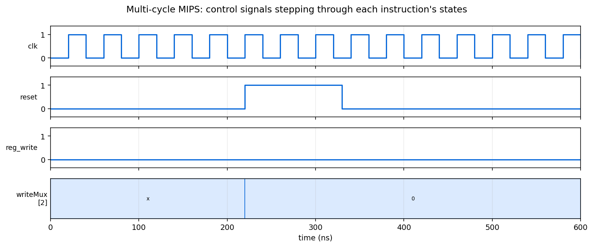

# Multi-Cycle MIPS

A MIPS processor in SystemVerilog that spreads each instruction over several
clock cycles, reusing one ALU and one memory across all of them.



## Requirements

[Icarus Verilog](https://steveicarus.github.io/iverilog/) and `make`.

## Simulating

```bash
make sim
```

Loads `Code/memory.mem`, runs the program, and writes `Code/sim.vcd`.

## Why multiple cycles

A single-cycle design must make its clock period long enough for a load, the
longest path through the machine, and every other instruction then waits that
long too. Splitting instructions into steps lets the clock run at the speed of
one step instead, and lets short instructions finish in fewer of them.

The saving comes from sharing. One ALU serves the PC increment, the branch target
calculation and the actual arithmetic, on different cycles. One memory serves
both instruction fetch and data access. What a single-cycle design duplicates in
hardware, this design reuses in time, at the cost of a control unit that is now a
state machine rather than a lookup.

Register banks between the stages hold values that a later cycle needs, since the
units producing them are reused before then.

## Control

`Controller` walks the states each instruction requires: fetch, decode, then a
path that depends on the opcode. It drives the datapath's mux selects, register
enables and memory controls, and decides which state comes next from the opcode
and the ALU flags. `ALU_control` translates the operation and function field into
the ALU's own opcode.

The waveform shows this directly. Control signals move in groups every few
cycles rather than every cycle, one group per state.

## Project structure

```
Code/
    MIPS.sv                the top level
    Controller.sv          the state machine
    ALU_CU.sv              operation and function field to ALU opcode
    Datapath.sv            wires the shared units together
    ALU_32bit.sv, RegisterFile.sv, Memory.sv, PC.sv
    SignExtend.sv, MUX_Utility.sv, REG_Write_Signal.sv
    memory.mem             the program and data
    testbench.sv           clock, reset, and run
docs/waveform.png          the figure above
Makefile                   sim and clean
```
